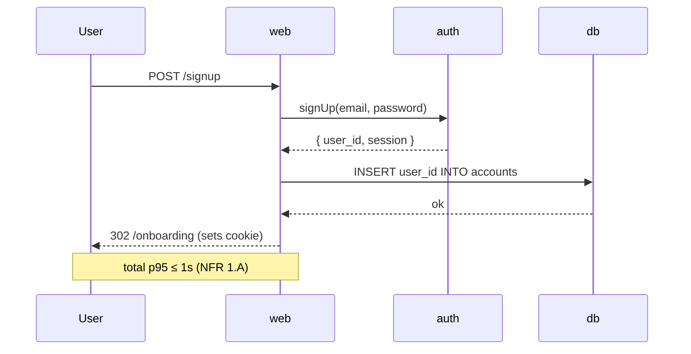
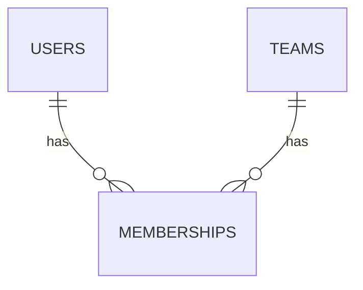

# Create Architecture

# Create Architecture

**Goal.** Design the system inside Fury's frame. Components, sequences, data flows, ADRs. Concrete enough that Shuri can implement and Hawkeye can write `tea-design.md` for every story.

Tony drives. Output lands in `.wize/solutioning/architecture.md` + `.wize/solutioning/adrs/`.

## Inputs

- `.wize/planning/prd.md` (validated)
- `.wize/planning/ux/ux-design/` (every architectural decision should make at least one screen possible)
- `.wize/planning/tech-vision.md` (the frame)
- `.wize/planning/nfr-principles.md` (the budget)
- `.wize/solutioning/design-system/` (Mantis' tokens, when available)
- Stack catalogs (overlays): `web-overlay/stack-catalog.md`, `app-overlay/stack-catalog.md`
- `.wize/knowledge/document-project/` (brownfield only)

## Outputs

- `.wize/solutioning/architecture.md`
- `.wize/solutioning/adrs/ADR-NNN-{slug}.md` (one ADR per meaningful trade-off)

## Steps

### 1. Stack interview (Tony asks; Wizer relays)

Resolve every "TBD" the tech-vision left for Tony. Walk the stack catalog (active overlay) and decide, in order:

- Language(s) + runtime(s).
- Front-end framework + state lib + form lib.
- Back-end framework or BaaS.
- DB + ORM/query builder.
- Auth.
- Hosting + CI/CD.
- Observability stack.
- Test stack (links to `playwright-vitest.md` or `detox-maestro.md`).

Decisions Tony makes silently are ADR candidates; decisions Fury already fixed don't get their own ADR.

### 2. Components

List components with one-line responsibility each. Boundaries before internals. Examples (web SaaS):

| Component | Responsibility | Boundary |
|---|---|---|
| `web` | Server-rendered fullstack app (Next.js) | HTTPS to clients; SQL to db; HTTPS to auth-provider |
| `db` | Source of truth for users, teams, billing (Postgres) | SQL only via PgBouncer |
| `auth` | Identity provider (Supabase Auth) | OIDC to `web` |
| `mailer` | Outbound transactional email | HTTPS to Resend |
| `worker` | Outbox processor + scheduled jobs (pg_cron) | SQL to db; HTTPS to external APIs |

### 3. Sequences (the critical ones)

For each "moment of truth" in `.wize/planning/ux/ux-scenarios.md`, draw a sequence. Mermaid is fine; ASCII is fine.



Annotate each sequence with the NFR target it must hit.

### 4. Data model

For every entity:

- Name, columns, types, indexes.
- Foreign keys + cascade behavior.
- RLS policies if the stack supports them (Supabase, etc.).
- Soft-delete vs hard-delete.

Include a mini ERD (Mermaid `erDiagram`).

### 5. Cross-cutting concerns

For each, name the pattern and the library/component:

- **Auth & session** — token shape, refresh, multi-device.
- **Errors** — error class hierarchy, mapping to HTTP, user-facing copy.
- **Logging** — structured (JSON), correlation IDs, sampling.
- **Observability** — metrics emitter, traces, dashboards.
- **Config** — env vars, secrets, feature flags.
- **Background jobs** — outbox / queue / scheduler.
- **Idempotency** — keys on write endpoints.
- **i18n** — string source, translation pipeline.
- **A11y** — token + library choices that uphold WCAG.

### 6. NFR check (every category)

Walk Fury's NFRs. For each non-negotiable, write *how* the architecture achieves it.

- Perf: LCP ≤ 2.5s → edge runtime + RSC + image policy.
- Security: PII in EU → DB in `eu-central-1`; backups in same region.
- Reliability: 99.9% → single-region with multi-AZ; failover playbook in `adrs/ADR-007-failover.md`.
- A11y: WCAG AA → Radix primitives + axe in CI.

### 7. ADRs

One ADR per meaningful trade-off. Format below. Number sequentially. Don't gold-plate; an ADR is a few paragraphs.

### 8. Hand off

Mark `architecture.md` `status: ready-for-stories`. Tony continues with `wize-create-epics-and-stories`.

## Architecture doc template

```markdown
---
status: ready-for-stories
owner: Tony Stark
created: YYYY-MM-DD
---

# Architecture — {{project_name}}

## Summary
{{One paragraph: stack family, runtime, primary data store, deploy target. The frame.}}

## Stack
- Language: TypeScript
- Front-end: Next.js (App Router, RSC, edge runtime)
- Back-end: Server Actions + Route Handlers
- DB: Supabase Postgres + Drizzle ORM
- Auth: Supabase Auth
- Hosting: Vercel
- Observability: Vercel + PostHog
- Test: Vitest + Playwright (see playbook)

## Components
| Component | Responsibility | Boundary |
|---|---|---|

## Data model
- `users` (id PK, email UNIQUE, created_at)
- `teams` (id PK, name, owner_id FK users)
- `memberships` (user_id, team_id, role)
- RLS: `auth.uid() = user_id` on all user-scoped tables.



## Sequences

### S1: Sign-up
{{sequence diagram + NFR annotation}}

### S2: Invite teammate
{{sequence diagram}}

## Cross-cutting
- Auth & session: …
- Errors: …
- Logging: …
- Observability: …
- Config: …
- Background jobs: …
- Idempotency: …
- i18n: …
- A11y: …

## NFR check
- Perf (1.A): how
- Security (2.A): how
- Reliability (3.A): how
- Maintainability (4.A): how
- A11y (5.A): how
- Cost (6.A): how

## ADRs
See `.wize/solutioning/adrs/`.
```

## ADR template

```markdown
---
status: accepted | superseded | deprecated
date: YYYY-MM-DD
deciders: Tony, Fury
supersedes: ADR-XXX
---

# ADR-007: {{slug}}

## Context
{{2–4 sentences: what forced the decision, what constraint is binding.}}

## Options
1. {{Option A}} — pros / cons / cost
2. {{Option B}} — pros / cons / cost
3. {{Option C}} — pros / cons / cost

## Decision
{{The pick. One sentence.}}

## Consequences
- **Now:** what we gain, what we accept.
- **Later:** what we'll likely revisit and when.
- **Related ADRs:** ADR-005, ADR-009.
```

## Anti-patterns Tony rejects

- **Architecture without sequences.** A diagram with boxes is half a doc.
- **NFR check left as "TBD".** Each non-negotiable answers *how*.
- **ADRs for trivial choices** (which CSS file name) — saves nothing, costs trust.
- **No ADR for genuinely contested choices** (auth provider, DB selection) — future-readers will re-litigate.
- **Diagrams in proprietary format only.** Mermaid/ASCII version always present in markdown.

## Hand-off

> Architecture and 6 ADRs at `.wize/solutioning/`. Sequences hit the NFR targets. Hawkeye, you can write `tea-risk.md` against this. Tony continues with `wize-create-epics-and-stories`.
